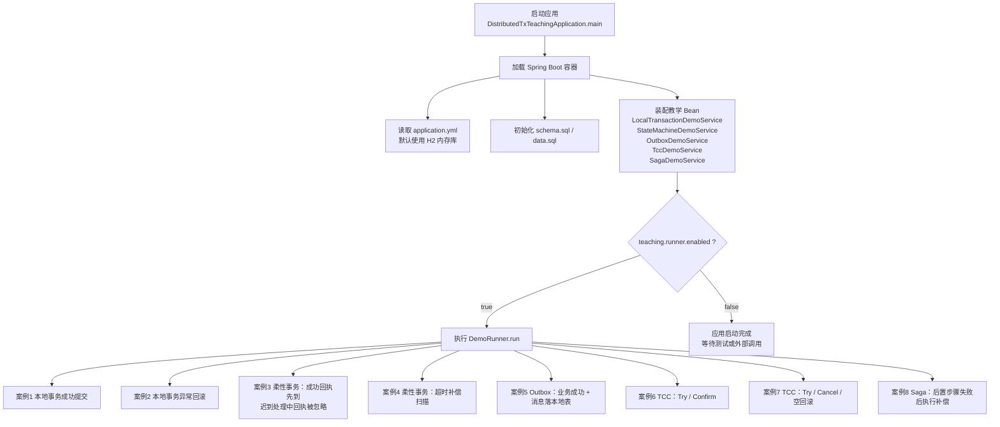

# distributed-tx-demo

一个专门讲 **分布式事务 / 最终一致性 / 柔性事务** 的教学项目。

这个项目不追求复杂业务，而是用尽量小的订单/资金场景，把下面这些概念讲清楚：

1. 本地事务到底能保证什么
2. 为什么 `@Transactional` 管不了外部系统
3. 为什么很多真实项目不会直接上 XA / 2PC
4. 什么叫柔性事务、最终一致性
5. 本地消息表（Outbox）怎么保证“业务成功后消息不丢”
6. 状态机 + 幂等 + 补偿为什么是资金类场景常见解法
7. TCC 的核心思想是什么，为什么它复杂
8. Saga 和 TCC 的区别是什么
9. 面试里怎么结合项目说“分布式事务”最稳

---

## 这个项目讲什么

### 1. 本地事务 demo

对应代码：

- `localtx/LocalTransactionDemoService.java`

会直接演示：

- 正常转账提交
- 运行时异常触发回滚

你要理解的是：

> 本地事务能保证单库内原子性，但它不能把“数据库写入 + 外部系统调用”打包成一个真全局事务。

### 2. 柔性事务 / 状态机 demo

对应代码：

- `state/StateMachineDemoService.java`

会直接演示：

- 指令先落库，进入 `WAIT_RECEIPT`
- 成功回执先到
- 迟到的处理中回执再到，但不能把终态冲回去
- 超时未终态的数据，如何通过补偿扫描收敛

### 3. Outbox 本地消息表 demo

对应代码：

- `outbox/OutboxDemoService.java`

会演示：

- 业务订单和 outbox_event 同事务提交
- 第一次投递失败
- 后台重试再次投递成功
- 消费端用幂等表防重复消费

核心理解：

> 业务成功后消息不能丢，这件事不能靠“祈祷 MQ 一次成功”，而要靠本地消息表兜底。

### 4. TCC 思想 demo

对应代码：

- `tcc/TccDemoService.java`

会演示：

- Try：冻结余额
- Confirm：正式扣减
- Cancel：释放冻结
- empty cancel（空回滚）
- hanging prevention（防悬挂）

这里不是接入真正的 TCC 框架，而是先把思想讲透。

### 5. Saga 编排思想 demo

对应代码：

- `saga/SagaDemoService.java`

会演示：

- 先冻结资金、再预占库存、再创建发货
- 如果后续步骤失败，不做数据库总回滚
- 而是按顺序执行补偿动作，把系统拉回一致

---

## 这个项目怎么学

建议按这个顺序看：

1. `LocalTransactionDemoService`
2. `StateMachineDemoService`
3. `OutboxDemoService`
4. `TccDemoService`
5. `SagaDemoService`
6. `DemoRunner`
7. `docs/DISTRIBUTED_TX_PATTERN_GUIDE.md`
8. 各模块测试

---

## 执行流程图



---
## 如何运行

这个项目默认使用 **H2 内存数据库**，不需要你额外准备 MySQL、Redis、MQ。

直接启动：

```bash
mvn spring-boot:run
```

启动后会按顺序打印这些案例：

1. 本地事务成功提交
2. 本地事务失败回滚
3. 状态机防止迟到回执把终态冲回去
4. 超时补偿 / 对账扫描
5. Outbox 投递失败后重试成功
6. TCC 成功确认
7. TCC 取消 / 空回滚 / 防悬挂
8. Saga 失败补偿

---

## 如何运行测试

```bash
mvn test
```

重点看：

- `LocalTransactionDemoTest`
- `StateMachineDemoTest`
- `OutboxDemoTest`
- `TccDemoTest`
- `SagaDemoTest`

---

## 面试里怎么说最稳

如果面试官问“你项目里怎么做分布式事务”，最稳的表达通常不是上来就说 Seata，而是先分场景：

### 1. 单库场景

> 单库内我会优先用本地事务，保证原子性。

### 2. 跨系统场景

> 如果跨数据库、跨服务、跨第三方系统，我更倾向按业务场景选柔性事务方案，比如状态机 + 幂等 + 补偿，或者本地消息表；只有在确实需要强一致、且参与方可控时，才会考虑 TCC / Seata 一类方案。

### 3. 资金类场景

> 像资金回执、银行通知这类场景，本质上很难做成一个强一致大事务，所以更常见的是：本地事务保证起点正确，状态机和幂等保证过程可控，补偿和对账保证最终一致。

---

## 各种方案怎么选

| 方案 | 一致性 | 成本 | 适合场景 |
|---|---|---:|---|
| 本地事务 | 强一致（单库） | 低 | 单服务单库 |
| 状态机 + 补偿 | 最终一致 | 低到中 | 外部银行、第三方回执 |
| Outbox | 最终一致 | 中 | DB + MQ/事件总线 |
| TCC | 强约束型最终一致 | 高 | 资源预留、余额冻结 |
| Saga | 最终一致 | 中到高 | 长流程、多步骤业务 |
| XA / 2PC | 强一致 | 很高 | 参与方都可控且链路较短 |

---

## 关键源码位置

- 应用入口：`DistributedTxTeachingApplication.java`
- 串讲入口：`demo/DemoRunner.java`
- 重置基线数据：`common/DemoDataResetService.java`
- 账户仓储：`common/WalletAccountRepository.java`
- 本地事务：`localtx/LocalTransactionDemoService.java`
- 状态机柔性事务：`state/StateMachineDemoService.java`
- Outbox：`outbox/OutboxDemoService.java`
- TCC：`tcc/TccDemoService.java`
- Saga：`saga/SagaDemoService.java`
- 教学文档：`docs/DISTRIBUTED_TX_PATTERN_GUIDE.md`

---

## 如果你最关心“项目里真正使用的分布式事务方案”

那你优先只看这 3 个地方：

1. `PROJECT_STYLE_DISTRIBUTED_TX_GUIDE.md`
2. `state/StateMachineDemoService.java`
3. `projectpattern/ProjectStyleDistributedTxTest.java`

这一条主线专门讲的是：

> **本地事务 + 状态机 + 幂等 + 定时补偿/对账**

也就是最贴近真实资金、回执、银行通知场景的那套做法。
