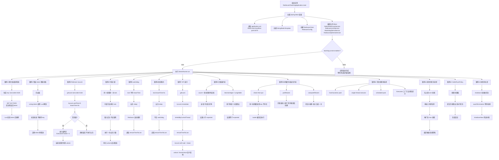

# redis-lock-demo

一个专门讲 **Redis 分布式锁 + Redisson** 的教学项目。

这个项目不追求复杂业务，而是用最小场景把这些面试题讲清楚：

1. Redis 分布式锁怎么实现
2. Redis 原生能力和 Redisson 有什么区别
3. 锁为什么必须设置超时时间
4. 为什么必须由持有者自己释放
5. 正确释放锁时为什么要防竞态
6. `RedissonClient` / `RLock` 常见 API 是干什么的
7. watchdog 机制解决什么问题
8. 悲观锁和乐观锁怎么选
9. 可重入锁和不可重入锁有什么区别
10. JVM 并发下 `count++` 为什么会丢数据
11. `AtomicInteger` 和 `LongAdder` 为什么是安全的
12. 本地缓存“先判断再放入”为什么会并发出问题
13. `putIfAbsent` 和 `computeIfAbsent` 到底差在哪
14. 工作项目里线程池通常怎么选、怎么建、怎么关
15. 线程池里的任务到底是怎么流转的
16. 为什么生产里更推荐显式 `ThreadPoolExecutor`
17. Spring `ThreadPoolTaskExecutor + @Async` 在项目里怎么分层使用
18. 为什么 xtimer 那类项目会拆 `schedulerPool` 和 `workerPool`
19. MySQL 慢查询怎么复现、定位和优化
20. Redis 主从同步失败、主挂从切换时，为什么锁会失效
21. 纯 Redis 分布式锁为什么不能作为最终兜底
22. 什么是 fencing token，为什么它能补上最终一致性防线
23. 多个异步子线程并发时，怎么避免一个子线程崩溃拖垮父流程
24. 子线程异常怎么拿，`Future.get`、`CompletableFuture`、`UncaughtExceptionHandler` 分别适合什么场景
25. `try/catch` 应该放在子任务边界还是父编排边界

---

## 新增：MySQL 慢查询排查实验室

这个仓库原来主线是 Redis 锁、JVM 并发和线程池。

为了不把现有 Spring Boot 依赖改复杂，我额外补了一个**独立的 MySQL 慢查询实验室**，你可以直接基于**你本机已有的 MySQL** 造数据、复现慢 SQL、看 slow log、跑 `EXPLAIN ANALYZE`，然后按步骤优化。

入口在这里：

- `mysql-slow-query-lab/README.md`
- `mysql-slow-query-lab/TEACHING_GUIDE.md`
- `mysql-slow-query-lab/sql/00_enable_slow_log_example.sql`
- `mysql-slow-query-lab/sql/01_init_data.sql`
- `mysql-slow-query-lab/sql/02_teaching_cases.sql`

这个实验室会带你复现三类最常见问题：

1. **先用 `SELECT SLEEP(...)` 验证 slow log 配置是否真的生效**
2. **对索引列使用函数，导致索引失效**
3. **`WHERE + ORDER BY` 缺少合适联合索引，导致扫描和排序变重**
4. **`LIKE '%xxx'` 和隐式类型转换这类真实项目高频坑**

如果你现在的目标是“能亲手复现，然后学会排查”，建议你先直接看：

- `mysql-slow-query-lab/README.md`
- `mysql-slow-query-lab/TEACHING_GUIDE.md`

## 这个项目怎么学

建议按这个顺序看：

1. `NativeRedisLockService`
2. `RedissonLockService`
3. `WatchdogDemoService`
4. `RedissonApiDemoService`
5. `CounterConcurrencyDemoService`
6. `CacheConcurrencyDemoService`
7. `OrderedThreadExecutionDemoService`
8. `ThreadPoolTeachingDemoService`
9. `SpringAsyncPoolDemoService`
10. `MasterReplicaFailoverDemoService`
11. `AsyncExceptionHandlingDemoService`
12. `DemoRunner`
13. `RedisLockDemoTest`
14. `ConcurrencyDemoTest`
15. `ThreadPoolTeachingDemoTest`
16. `SpringAsyncPoolDemoTest`
17. `MasterReplicaFailoverDemoTest`
18. `AsyncExceptionHandlingDemoTest`

---

## 执行流程图

下面这张图按项目实际启动顺序整理，主线对应 `RedisLockTeachingApplication -> DemoRunner -> 各个演示 Service`：



---

## 新增：线程池实战 demo

这一部分讲的是工作项目里最常见的线程池问题：

1. 线程池一般怎么选
2. 为什么很多项目更推荐显式 `new ThreadPoolExecutor(...)`
3. 一个任务提交进去后，为什么会经历 core -> queue -> max -> reject
4. 拒绝策略到底怎么影响调用方
5. 线程池怎么优雅关闭

### 1. 工作里常见哪些线程池

这个项目里先给你一个实用视角，而不是把 API 全背一遍：

- **fixed business pool**：最常见，适合接口聚合、批量异步处理
- **single thread executor**：适合必须严格顺序执行的本地任务
- **scheduled pool**：适合延迟任务、定时任务
- **显式 `ThreadPoolExecutor`**：更适合生产里做容量控制

对应代码：

- `src/main/java/com/example/redislockdemo/concurrency/ThreadPoolTeachingDemoService.java`

### 2. 为什么生产里更推荐显式 `ThreadPoolExecutor`

因为你能把几个关键参数明确写出来：

- `corePoolSize`
- `maximumPoolSize`
- `keepAliveTime`
- `BlockingQueue`
- `ThreadFactory`
- `RejectedExecutionHandler`

也就是说，你不是“开一个线程池就完了”，而是在明确规定：

- 平时允许多少线程工作
- 能排队多少任务
- 瞬时高峰最多再扩多少线程
- 满载后怎么处理
- 线程叫什么名字，后面排查日志和线程 dump 时更好认

### 3. 任务是怎么流转的

这个项目里专门做了一个 bounded `ThreadPoolExecutor` demo，演示这条主线：

1. 先占满 `corePoolSize`
2. 再进入队列
3. 队列满了再扩到 `maximumPoolSize`
4. 再超就触发拒绝策略

你启动后会看到类似这种输出：

- `task-1 accepted, poolSize=1, active=1, queue=0`
- `task-2 accepted, poolSize=2, active=2, queue=0`
- `task-3 accepted, poolSize=2, active=2, queue=1`
- `task-4 accepted, poolSize=2, active=2, queue=2`
- `task-5 accepted, poolSize=3, active=3, queue=2`
- `task-6 accepted, poolSize=4, active=4, queue=2`
- `task-7 rejected`

这就是面试和工作里最常说的那条规则：

> 先 core，再 queue，再 max，最后 reject。

### 4. 为什么要讲拒绝策略

因为线程池不是“无限吞任务”的黑洞。

当线程池满载时，系统必须做选择：

- 直接拒绝
- 让调用方线程自己执行
- 丢弃任务
- 丢弃旧任务

这个项目里重点演示两个最常见、最值得理解的：

- `AbortPolicy`：直接抛异常，快速失败
- `CallerRunsPolicy`：提交任务的线程自己执行，形成回压

其中 `CallerRunsPolicy` 在很多内部系统里很有教育意义，因为它不会偷偷吞任务，而是让上游感受到压力。

### 5. 线程池怎么关闭

项目里也单独做了关闭流程 demo，讲清楚：

- `shutdown()`：不再接收新任务，但会等已提交任务收尾
- `awaitTermination()`：等待线程池优雅结束
- `shutdownNow()`：兜底手段，尝试中断正在执行的任务，并返回还没开始的任务

实际工作里最常见的正确思路就是：

> 优先 `shutdown + awaitTermination`，只有兜底才 `shutdownNow`。

### 6. 为什么不要无脑用 `Executors.*`

这部分 README 也给你一个实战提醒：

- `Executors.newFixedThreadPool(...)`：线程数固定，但默认队列可能无界，任务堆积时风险大
- `Executors.newSingleThreadExecutor()`：也可能悄悄把 backlog 一直堆起来
- `Executors.newCachedThreadPool()`：在高峰流量下可能快速扩很多线程，带来线程膨胀风险

所以教学上可以看，旧代码里也常见，但**生产默认方案更建议显式 new `ThreadPoolExecutor(...)`**。

---

## 这个项目讲什么

### 1. Redis 原生锁最小正确写法

核心不是只会背 `setnx`，而是要知道正确组合是：

- `SET key value NX PX/EX`
- `value` 必须唯一，代表锁持有者
- 解锁不能直接 `DEL`
- 解锁必须先校验 `value`，再删除
- 校验和删除必须放进 Lua 脚本里原子执行

对应代码：

- `src/main/java/com/example/redislockdemo/nativeapi/NativeRedisLockService.java`

### 2. 为什么必须设置超时时间

因为持锁线程可能：

- 宕机
- 卡死
- 网络中断
- GC 停顿太久

如果没有过期时间，锁可能永远不释放。

### 3. 为什么必须由持有者自己释放

因为锁过期后，别人可能已经拿到了同一把新锁。

如果旧线程这时还去直接删 key，就会把别人的锁删掉。

所以：

- 锁的 `value` 必须唯一
- 解锁时必须比对 `value`

### 4. 为什么工程里更常用 Redisson

因为它已经帮你封装好了：

- 可重入锁
- `tryLock`
- `lock`
- `unlock`
- 当前线程持有判断
- watchdog 自动续期

对应代码：

- `src/main/java/com/example/redislockdemo/redisson/RedissonLockService.java`
- `src/main/java/com/example/redislockdemo/api/RedissonApiDemoService.java`

### 5. watchdog 是什么

watchdog 是 Redisson 的自动续期机制。

它解决的问题是：

> 业务执行时间不好估。

- 时间设短了，业务没执行完锁就过期
- 时间设长了，异常恢复太慢

所以 Redisson 在**不显式传 `leaseTime`** 时，会自动帮你续期。

对应代码：

- `src/main/java/com/example/redislockdemo/watchdog/WatchdogDemoService.java`

### 6. 面试里怎么回答悲观锁和乐观锁

最稳的说法：

- **悲观锁**：先锁住再改，认为冲突概率高
- **乐观锁**：先不锁，更新时校验版本/CAS，失败再重试

Redis 分布式锁更接近：

- **悲观控制思路**

### 7. 面试里怎么回答可重入锁

最稳的说法：

- **可重入锁**：同一线程已经拿到锁后，再次进入同一把锁保护的代码时，还能继续拿到锁，不会把自己锁死
- **不可重入锁**：同一线程第二次再拿同一把锁时，会卡住或失败

Redisson 的 `RLock` 就是可重入锁。

### 8. JVM 并发里怎么回答 `count++` 为什么不安全

最短答法：

> 因为 `count++` 不是原子操作，它会拆成读、改、写三步，多线程并发时会发生丢失更新。

### 9. JVM 并发里怎么回答 `AtomicInteger` 和 `LongAdder`

最稳的说法：

- **AtomicInteger**：用原子操作保证单个计数值更新正确
- **LongAdder**：也是线程安全计数器，高并发下通常比单点 CAS 更适合做热点计数

### 10. JVM 并发里怎么回答缓存初始化竞态

最短答法：

> `if (get == null) { put(...) }` 不是原子操作，多个线程可能同时发现 key 不存在，于是重复初始化。`putIfAbsent` 只能保证放入原子，`computeIfAbsent` 更适合“没有就创建一次”的缓存初始化。

### 11. 线程池任务为什么会排队、扩线程、再拒绝？

最短答法：

> `ThreadPoolExecutor` 的基本流转是：先用 core 线程，core 满了再进队列，队列满了再扩到 max，最后再触发拒绝策略。

### 12. 为什么生产里更推荐显式 `ThreadPoolExecutor`？

最短答法：

> 因为它能把核心线程数、最大线程数、队列容量、线程命名和拒绝策略都明确配置出来，比直接用 `Executors.*` 更可控。

---

## 如何运行

### 1. 准备本地 Redis

默认配置：

- host: `localhost`
- port: `6379`

你需要先本地启动一个 Redis。

### 2. 启动项目

```bash
mvn spring-boot:run
```

启动后会按顺序打印这些案例：

1. Redis 原生锁成功获取 / 释放
2. 错误 token 不能释放别人的锁
3. Redisson `tryLock` 只有拿到锁才进入临界区
4. Redisson 可重入锁示例
5. watchdog 自动续期示例
6. 显式 `leaseTime` 不走 watchdog 的对照示例
7. `RedissonClient` / `RLock` API 示例
8. `count++` / `AtomicInteger` / `LongAdder` 并发计数对比
9. check-then-put / `putIfAbsent` / `computeIfAbsent` 缓存初始化对比
10. `T1 -> T2 -> T3` 顺序执行：`join` / `CountDownLatch` / `Semaphore` / `Condition`
11. 订单防重复提交：先查再创建 vs 先抢占再创建
12. 常见线程池选择
13. 线程池任务流转：core -> queue -> max -> reject
14. `CallerRunsPolicy` 回压示例
15. 线程池关闭流程示例
16. `schedulerPool -> workerPool` 双线程池分工示例

---

## 如何运行测试

```bash
mvn test
```

测试分三类：

- Redis 锁相关测试：依赖本地 Redis
- JVM 并发 demo 测试：不依赖 Redis
- 线程池 demo 测试：不依赖 Redis

如果你只是先看 JVM 并发和线程池这部分，建议先跑：

```bash
mvn -Dtest=ConcurrencyDemoTest,ThreadPoolTeachingDemoTest test
```

这样你不用先准备 Redis，也能先把并发计数、缓存竞态、线程顺序控制、线程池流转、拒绝策略、关闭流程这些核心 demo 跑出来。

重点看：

- `RedisLockDemoTest`
- `ConcurrencyDemoTest`
- `ThreadPoolTeachingDemoTest`

---

## 面试最短答法

### Redis 原生分布式锁怎么实现？

最短答法：

> 用 `SET key value NX PX/EX` 加锁，`NX` 保证互斥，`PX/EX` 保证自动过期，`value` 用唯一标识代表持有者；解锁时不能直接 `DEL`，而要用 Lua 脚本先校验 value 再删除。

### 为什么必须设置超时时间？

> 防止持锁线程宕机后锁永远不释放，避免死锁。

### 为什么必须由持有者自己释放？

> 因为锁过期后别人可能已经拿到新锁了，旧线程再删 key 会误删别人的锁。

### Redisson 比手写 Redis 锁强在哪？

> 它把锁封装成了 `RLock`，支持可重入、阻塞等待、`tryLock`、owner 线程解锁和 watchdog 自动续期，更适合 Java 工程实践。

### watchdog 是干什么的？

> 它解决的是业务执行时间不好估的问题。在不显式传 `leaseTime` 时，Redisson 会自动续期，避免业务没执行完锁就先过期。

### `count++` 为什么不安全？

> 因为它不是原子操作，会拆成读、改、写三步，多线程并发时会发生丢失更新。

### `putIfAbsent` 和 `computeIfAbsent` 差在哪？

> `putIfAbsent` 只保证放入动作原子，但可能先重复创建 value；`computeIfAbsent` 更适合“key 不存在时只初始化一次”。

### `T1`、`T2`、`T3` 怎么顺序执行？

> 核心是让后一个线程等待前一个线程发出的“完成信号”。常见写法有 `join`、`CountDownLatch`、`Semaphore`、`ReentrantLock + Condition`。本质上都是把执行资格从 `T1` 传给 `T2`，再传给 `T3`。

### 线程池为什么会拒绝任务？

> 因为线程池容量不是无限的。常见流转是先 core、再 queue、再 max，最后超出容量后才触发拒绝策略。

### 为什么不要无脑用 `Executors.newFixedThreadPool()`？

> 因为它背后常常是无界队列，流量持续堆积时可能把延迟和内存问题悄悄放大。生产里更推荐显式配置 `ThreadPoolExecutor`。

### 主从同步失败、主挂从切换为什么会让 Redis 锁失效？

> 因为 Redis 主从复制默认是异步的。A 刚在 master 拿到锁，这把锁还没复制到 replica，master 就挂了；replica 升主后看不到这把锁，B 就可能再次拿到同一把锁，互斥性就被破坏了。

### 这种情况下还有最终兜底方案吗？

> 单靠 Redis 锁没有最终兜底。真正的兜底要放在下游资源上，比如 fencing token + version/CAS、唯一索引、幂等表、状态机前进校验。也就是“锁只能减少并发，最终正确性要靠业务资源自己把关”。

### 多个异步子线程并发时，怎么避免一个子线程拖垮父线程？

> 父线程不能只把任务扔出去不管，要保留 `Future` 或 `CompletableFuture` 句柄；子任务边界自己捕获异常、补齐上下文、释放资源，父线程再统一 `get/join` 汇总结果，决定重试、降级还是补偿。

### 子线程异常怎么获取？

> `ExecutorService.submit` 用 `Future.get()`；`CompletableFuture` 用 `join` / `handle` / `whenComplete`；原生 `Thread` 的 fire-and-forget 场景至少要配 `UncaughtExceptionHandler`。

### `try/catch` 应该放在哪里？

> 第一层放在子任务边界，负责记录业务上下文和释放当前线程资源；第二层放在父编排边界，负责汇总所有子任务结果并决定是否重试、补偿或快速失败。不要只在父线程外层写一个大 `try/catch`，它抓不到已经异步出去的异常。

---

## 关键源码位置

- 原生锁：`nativeapi/NativeRedisLockService.java`
- Redisson 主线：`redisson/RedissonLockService.java`
- watchdog：`watchdog/WatchdogDemoService.java`
- API：`api/RedissonApiDemoService.java`
- 主从切换锁失效：`failover/MasterReplicaFailoverDemoService.java`
- JVM 计数器并发：`concurrency/CounterConcurrencyDemoService.java`
- JVM 缓存并发：`concurrency/CacheConcurrencyDemoService.java`
- JVM 顺序执行：`concurrency/OrderedThreadExecutionDemoService.java`
- 线程池教学：`concurrency/ThreadPoolTeachingDemoService.java`
- 异步异常治理：`concurrency/AsyncExceptionHandlingDemoService.java`
- 串讲入口：`demo/DemoRunner.java`
- Redis 锁测试：`src/test/java/com/example/redislockdemo/RedisLockDemoTest.java`
- JVM 并发测试：`src/test/java/com/example/redislockdemo/concurrency/ConcurrencyDemoTest.java`
- 线程池测试：`src/test/java/com/example/redislockdemo/concurrency/ThreadPoolTeachingDemoTest.java`
- 主从切换测试：`src/test/java/com/example/redislockdemo/failover/MasterReplicaFailoverDemoTest.java`
- 异步异常测试：`src/test/java/com/example/redislockdemo/concurrency/AsyncExceptionHandlingDemoTest.java`

---

## 新增：JVM 并发和线程安全 demo

这部分不是分布式锁，而是**单机 JVM 内多线程**面试里最常见的三类题：

1. `count++` 在并发下为什么不安全
2. 本地缓存 `if (get == null) { put(...) }` 为什么不安全
3. `T1`、`T2`、`T3` 怎么按顺序执行

### 1. 计数器：为什么 `count++` 会丢数据

`count++` 看起来像一步，实际上是三步：

1. 读旧值
2. +1
3. 写回去

多个线程同时做这三步时，可能都读到同一个旧值，于是会发生**覆盖写回**，导致最终结果比期望值小。

这个项目里会直接跑三种版本：

- 不安全：`count++`
- 安全：`AtomicInteger`
- 安全：`LongAdder`

代码里也补了少量关键注释，主要告诉你：

- 哪段是故意保留的错误示范
- 为什么要用 `CountDownLatch` 把线程同时放开
- 为什么 `LongAdder` 更贴近高并发热点计数场景

你启动后会看到类似这种输出：

- `expected=1200000`
- `count++ actual < expected`
- `AtomicInteger actual = expected`
- `LongAdder actual = expected`

对应代码：

- `src/main/java/com/example/redislockdemo/concurrency/CounterConcurrencyDemoService.java`

### 2. 本地缓存：为什么 check-then-put 会有竞态

很多人会这样写：

```java
if (cache.get(key) == null) {
    String value = loadValue();
    cache.put(key, value);
}
```

问题在于：

- 线程 A 看到 key 不存在
- 线程 B 也看到 key 不存在
- A 和 B 都去执行 `loadValue()`
- 最后可能只有一个值留在 map 里，但初始化动作已经重复做了很多次

这就叫典型的 **check-then-act race condition**。

这个项目里会直接对比三种写法：

- 不安全：check-then-put
- 半安全：`putIfAbsent`
- 更适合缓存初始化：`computeIfAbsent`

代码里也补了少量关键注释，主要告诉你：

- check-then-put 为什么是典型竞态
- `putIfAbsent` 为什么只能保证“放入原子”，不能保证“只创建一次”
- `computeIfAbsent` 为什么更接近公司里本地缓存懒加载的常用写法

最关键区别：

- `putIfAbsent` 只能保证“放进去”这个动作原子，但**不能保证 value 只创建一次**
- `computeIfAbsent` 才更接近“没有就创建一次，然后放进去”

你启动后会看到类似这种输出：

- `check-then-put loaderCalls = 7`
- `putIfAbsent loaderCalls = 6`
- `computeIfAbsent loaderCalls = 1`

对应代码：

- `src/main/java/com/example/redislockdemo/concurrency/CacheConcurrencyDemoService.java`

### 3. 线程协调：怎么让 `T1 -> T2 -> T3` 顺序执行

这道题本质不是“怎么让线程一个都不并发”，而是：

- `T2` 必须等 `T1`
- `T3` 必须等 `T2`
- 顺序要靠同步原语保证，而不是赌 `start()` 调用顺序

这个项目里直接给了 4 种可运行写法：

- `join`：外层主线程显式等待前一个线程结束
- `CountDownLatch`：前一个线程结束后给后一个线程发完成信号
- `Semaphore`：把执行资格当成 permit 一路往后传
- `ReentrantLock + Condition`：更接近底层条件队列和阶段切换写法

你启动后会看到类似这种输出：

- `join -> executionOrder=[T1, T2, T3]`
- `CountDownLatch -> executionOrder=[T1, T2, T3]`
- `Semaphore -> executionOrder=[T1, T2, T3]`
- `ReentrantLock + Condition -> executionOrder=[T1, T2, T3]`

对应代码：

- `src/main/java/com/example/redislockdemo/concurrency/OrderedThreadExecutionDemoService.java`

---

## 这个项目讲什么

### 1. Redis 原生锁最小正确写法

核心不是只会背 `setnx`，而是要知道正确组合是：

- `SET key value NX PX/EX`
- `value` 必须唯一，代表锁持有者
- 解锁不能直接 `DEL`
- 解锁必须先校验 `value`，再删除
- 校验和删除必须放进 Lua 脚本里原子执行

对应代码：

- `src/main/java/com/example/redislockdemo/nativeapi/NativeRedisLockService.java`

### 2. 为什么必须设置超时时间

因为持锁线程可能：

- 宕机
- 卡死
- 网络中断
- GC 停顿太久

如果没有过期时间，锁可能永远不释放。

### 3. 为什么必须由持有者自己释放

因为锁过期后，别人可能已经拿到了同一把新锁。

如果旧线程这时还去直接删 key，就会把别人的锁删掉。

所以：

- 锁的 `value` 必须唯一
- 解锁时必须比对 `value`

### 4. 为什么工程里更常用 Redisson

因为它已经帮你封装好了：

- 可重入锁
- `tryLock`
- `lock`
- `unlock`
- 当前线程持有判断
- watchdog 自动续期

对应代码：

- `src/main/java/com/example/redislockdemo/redisson/RedissonLockService.java`
- `src/main/java/com/example/redislockdemo/api/RedissonApiDemoService.java`

### 5. watchdog 是什么

watchdog 是 Redisson 的自动续期机制。

它解决的问题是：

> 业务执行时间不好估。

- 时间设短了，业务没执行完锁就过期
- 时间设长了，异常恢复太慢

所以 Redisson 在**不显式传 `leaseTime`** 时，会自动帮你续期。

对应代码：

- `src/main/java/com/example/redislockdemo/watchdog/WatchdogDemoService.java`

### 6. 面试里怎么回答悲观锁和乐观锁

最稳的说法：

- **悲观锁**：先锁住再改，认为冲突概率高
- **乐观锁**：先不锁，更新时校验版本/CAS，失败再重试

Redis 分布式锁更接近：

- **悲观控制思路**

### 7. 面试里怎么回答可重入锁

最稳的说法：

- **可重入锁**：同一线程已经拿到锁后，再次进入同一把锁保护的代码时，还能继续拿到锁，不会把自己锁死
- **不可重入锁**：同一线程第二次再拿同一把锁时，会卡住或失败

Redisson 的 `RLock` 就是可重入锁。

### 8. JVM 并发里怎么回答 `count++` 为什么不安全

最短答法：

> 因为 `count++` 不是原子操作，它会拆成读、改、写三步，多线程并发时会发生丢失更新。

### 9. JVM 并发里怎么回答 `AtomicInteger` 和 `LongAdder`

最稳的说法：

- **AtomicInteger**：用原子操作保证单个计数值更新正确
- **LongAdder**：也是线程安全计数器，高并发下通常比单点 CAS 更适合做热点计数

### 10. JVM 并发里怎么回答缓存初始化竞态

最短答法：

> `if (get == null) { put(...) }` 不是原子操作，多个线程可能同时发现 key 不存在，于是重复初始化。`putIfAbsent` 只能保证放入原子，`computeIfAbsent` 更适合“没有就创建一次”的缓存初始化。

### 11. JVM 并发里怎么回答 `T1`、`T2`、`T3` 顺序执行

最稳的说法：

- `join`：适合外层线程显式串联
- `CountDownLatch`：适合前序完成后放行后序
- `Semaphore`：适合把执行许可往后传
- `ReentrantLock + Condition`：适合更复杂的阶段流转和条件等待

如果让我在面试里直接说，我会这样答：

> 如果只是让 3 个线程按 `T1 -> T2 -> T3` 顺序执行，最直接的是 `join`，由外层线程等前一个执行完再启动下一个。如果要让线程自己协调，我更常用 `CountDownLatch` 或 `Semaphore`，本质上都是 `T1` 完成后通知 `T2`，`T2` 完成后再通知 `T3`。如果阶段更多、状态更复杂，可以用 `ReentrantLock + Condition`。核心不是靠 `start()` 顺序，而是靠前一个线程给后一个线程发“完成信号”。

如果面试官继续追问“怎么选”，可以这样补：

- 只是 3 个线程顺序跑一遍：`join` 最简单
- 需要线程之间传递完成信号：`CountDownLatch`
- 需要把执行资格一级一级往后传：`Semaphore`
- 需要做多阶段状态控制：`ReentrantLock + Condition`

---

## 如何运行

### 1. 准备本地 Redis

默认配置：

- host: `localhost`
- port: `6379`

你需要先本地启动一个 Redis。

### 2. 启动项目

```bash
mvn spring-boot:run
```

启动后会按顺序打印这些案例：

1. Redis 原生锁成功获取 / 释放
2. 错误 token 不能释放别人的锁
3. Redisson `tryLock` 只有拿到锁才进入临界区
4. Redisson 可重入锁示例
5. watchdog 自动续期示例
6. 显式 `leaseTime` 不走 watchdog 的对照示例
7. `RedissonClient` / `RLock` API 示例
8. `count++` / `AtomicInteger` / `LongAdder` 并发计数对比
9. check-then-put / `putIfAbsent` / `computeIfAbsent` 缓存初始化对比

---

## 如何运行测试

```bash
mvn test
```

测试分两类：

- Redis 锁相关测试：依赖本地 Redis
- JVM 并发 demo 测试：不依赖 Redis

如果你只是先看并发和线程安全这部分，建议先跑：

```bash
mvn -Dtest=ConcurrencyDemoTest test
```

这样你不用先准备 Redis，也能先把 `count++`、`AtomicInteger`、`LongAdder`、check-then-put、`putIfAbsent`、`computeIfAbsent`、`T1 -> T2 -> T3` 这几组对比跑出来。

重点看：

- `RedisLockDemoTest`
- `ConcurrencyDemoTest`

---

## 面试最短答法

### Redis 原生分布式锁怎么实现？

最短答法：

> 用 `SET key value NX PX/EX` 加锁，`NX` 保证互斥，`PX/EX` 保证自动过期，`value` 用唯一标识代表持有者；解锁时不能直接 `DEL`，而要用 Lua 脚本先校验 value 再删除。

### 为什么必须设置超时时间？

> 防止持锁线程宕机后锁永远不释放，避免死锁。

### 为什么必须由持有者自己释放？

> 因为锁过期后别人可能已经拿到新锁了，旧线程再删 key 会误删别人的锁。

### Redisson 比手写 Redis 锁强在哪？

> 它把锁封装成了 `RLock`，支持可重入、阻塞等待、`tryLock`、owner 线程解锁和 watchdog 自动续期，更适合 Java 工程实践。

### watchdog 是干什么的？

> 它解决的是业务执行时间不好估的问题。在不显式传 `leaseTime` 时，Redisson 会自动续期，避免业务没执行完锁就先过期。

### `count++` 为什么不安全？

> 因为它不是原子操作，会拆成读、改、写三步，多线程并发时会发生丢失更新。

### `putIfAbsent` 和 `computeIfAbsent` 差在哪？

> `putIfAbsent` 只保证放入动作原子，但可能先重复创建 value；`computeIfAbsent` 更适合“key 不存在时只初始化一次”。

---

## 关键源码位置

---

## 这个项目讲什么

### 1. Redis 原生锁最小正确写法

核心不是只会背 `setnx`，而是要知道正确组合是：

- `SET key value NX PX/EX`
- `value` 必须唯一，代表锁持有者
- 解锁不能直接 `DEL`
- 解锁必须先校验 `value`，再删除
- 校验和删除必须放进 Lua 脚本里原子执行

对应代码：

- `src/main/java/com/example/redislockdemo/nativeapi/NativeRedisLockService.java`

### 2. 为什么必须设置超时时间

因为持锁线程可能：

- 宕机
- 卡死
- 网络中断
- GC 停顿太久

如果没有过期时间，锁可能永远不释放。

### 3. 为什么必须由持有者自己释放

因为锁过期后，别人可能已经拿到了同一把新锁。

如果旧线程这时还去直接删 key，就会把别人的锁删掉。

所以：

- 锁的 `value` 必须唯一
- 解锁时必须比对 `value`

### 4. 为什么工程里更常用 Redisson

因为它已经帮你封装好了：

- 可重入锁
- `tryLock`
- `lock`
- `unlock`
- 当前线程持有判断
- watchdog 自动续期

对应代码：

- `src/main/java/com/example/redislockdemo/redisson/RedissonLockService.java`
- `src/main/java/com/example/redislockdemo/api/RedissonApiDemoService.java`

### 5. watchdog 是什么

watchdog 是 Redisson 的自动续期机制。

它解决的问题是：

> 业务执行时间不好估。

- 时间设短了，业务没执行完锁就过期
- 时间设长了，异常恢复太慢

所以 Redisson 在**不显式传 `leaseTime`** 时，会自动帮你续期。

对应代码：

- `src/main/java/com/example/redislockdemo/watchdog/WatchdogDemoService.java`

### 6. 面试里怎么回答悲观锁和乐观锁

最稳的说法：

- **悲观锁**：先锁住再改，认为冲突概率高
- **乐观锁**：先不锁，更新时校验版本/CAS，失败再重试

Redis 分布式锁更接近：

- **悲观控制思路**

### 7. 面试里怎么回答可重入锁

最稳的说法：

- **可重入锁**：同一线程已经拿到锁后，再次进入同一把锁保护的代码时，还能继续拿到锁，不会把自己锁死
- **不可重入锁**：同一线程第二次再拿同一把锁时，会卡住或失败

Redisson 的 `RLock` 就是可重入锁。

---

## 如何运行

### 1. 准备本地 Redis

默认配置：

- host: `localhost`
- port: `6379`

你需要先本地启动一个 Redis。

### 2. 启动项目

```bash
mvn spring-boot:run
```

启动后会按顺序打印这些案例：

1. Redis 原生锁成功获取 / 释放
2. 错误 token 不能释放别人的锁
3. Redisson `tryLock` 只有拿到锁才进入临界区
4. Redisson 可重入锁示例
5. watchdog 自动续期示例
6. 显式 `leaseTime` 不走 watchdog 的对照示例
7. `RedissonClient` / `RLock` API 示例

---

## 如何运行测试

```bash
mvn test
```

测试依赖本地 Redis。

重点看：

- `RedisLockDemoTest`

---

## 面试最短答法

### Redis 原生分布式锁怎么实现？

最短答法：

> 用 `SET key value NX PX/EX` 加锁，`NX` 保证互斥，`PX/EX` 保证自动过期，`value` 用唯一标识代表持有者；解锁时不能直接 `DEL`，而要用 Lua 脚本先校验 value 再删除。

### 为什么必须设置超时时间？

> 防止持锁线程宕机后锁永远不释放，避免死锁。

### 为什么必须由持有者自己释放？

> 因为锁过期后别人可能已经拿到新锁了，旧线程再删 key 会误删别人的锁。

### Redisson 比手写 Redis 锁强在哪？

> 它把锁封装成了 `RLock`，支持可重入、阻塞等待、`tryLock`、owner 线程解锁和 watchdog 自动续期，更适合 Java 工程实践。

### watchdog 是干什么的？

> 它解决的是业务执行时间不好估的问题。在不显式传 `leaseTime` 时，Redisson 会自动续期，避免业务没执行完锁就先过期。

---

## 关键源码位置

- 原生锁：`nativeapi/NativeRedisLockService.java`
- Redisson 主线：`redisson/RedissonLockService.java`
- watchdog：`watchdog/WatchdogDemoService.java`
- API：`api/RedissonApiDemoService.java`
- JVM 计数器并发：`concurrency/CounterConcurrencyDemoService.java`
- JVM 缓存并发：`concurrency/CacheConcurrencyDemoService.java`
- JVM 顺序执行：`concurrency/OrderedThreadExecutionDemoService.java`
- 串讲入口：`demo/DemoRunner.java`
- Redis 锁测试：`src/test/java/com/example/redislockdemo/RedisLockDemoTest.java`
- JVM 并发测试：`src/test/java/com/example/redislockdemo/concurrency/ConcurrencyDemoTest.java`
