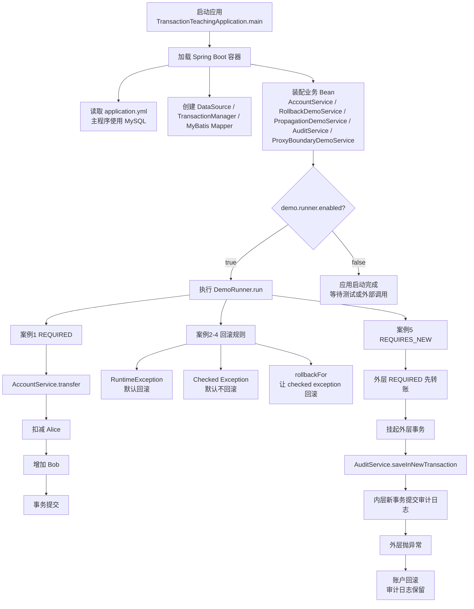
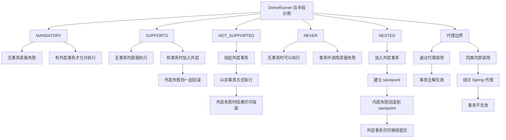

# spring-tx-demo

一个用 **Spring Boot + MyBatis + MySQL** 编写的事务学习项目，专门用来理解 Spring 的事务传播机制、回滚规则，以及代理边界问题。

这个项目的目标不是做复杂业务，而是通过一个尽量小、尽量直观的转账场景，把 Spring 事务讲清楚。

---

## 项目特点

- 使用 **Spring Boot 3**
- ORM 使用 **MyBatis**
- 主运行环境使用 **MySQL**
- 测试环境使用 **H2 内存数据库**
- 覆盖 **7 种事务传播机制**
- 包含可运行示例和测试用例
- 包含 self-invocation 导致事务失效的演示

---

## 这个项目讲什么

### 1. 基础事务行为

- 正常执行时提交
- 抛出 `RuntimeException` 时回滚
- checked exception 默认不回滚
- `rollbackFor` 如何让 checked exception 也回滚

### 2. 7 种事务传播机制

- `REQUIRED`
- `REQUIRES_NEW`
- `SUPPORTS`
- `NOT_SUPPORTED`
- `MANDATORY`
- `NEVER`
- `NESTED`

### 3. 常见事务坑

- 为什么 self-invocation 会导致 `@Transactional` 失效
- 为什么事务通常放在 Service 层
- `REQUIRES_NEW`、`NOT_SUPPORTED`、`NESTED` 的区别

---

## 项目结构

```text
src/main/java/com/example/transactiondemo/
├── account/
│   ├── Account.java
│   ├── AccountMapper.java
│   └── AccountService.java
├── audit/
│   ├── AuditLog.java
│   ├── AuditLogMapper.java
│   └── AuditService.java
├── demo/
│   └── DemoRunner.java
├── tx/
│   ├── PropagationDemoService.java
│   ├── ProxyBoundaryDemoService.java
│   ├── RollbackDemoService.java
│   ├── SelfInvocationDemoService.java
│   └── exception/
└── TransactionTeachingApplication.java
```

---

## 执行流程图

原来那张总图信息太密，渲染时会被整体缩小。这里拆成两张，并把 Mermaid 字号调大，阅读会更舒服。

### 1. 启动与核心事务主线



### 2. 传播机制与代理边界



---

## 如何运行主程序

### 1. 准备 MySQL

先创建数据库：

```sql
create database transaction_demo;
```

### 2. 修改配置

编辑：

- `src/main/resources/application.yml`

把下面这几个值改成你自己的：

- `spring.datasource.url`
- `spring.datasource.username`
- `spring.datasource.password`

默认配置只是占位示例，不是实际账号：

```yaml
spring:
  datasource:
    url: jdbc:mysql://localhost:3306/transaction_demo?useSSL=false&allowPublicKeyRetrieval=true&serverTimezone=Asia/Shanghai
    driver-class-name: com.mysql.cj.jdbc.Driver
    username: demo_user
    password: demo_password
```

### 3. 启动项目

```bash
mvn spring-boot:run
```

启动后，`DemoRunner` 会自动顺序打印事务示例。

---

## 如何运行测试

测试不依赖你本机 MySQL，直接使用 H2 内存数据库。

运行全部测试：

```bash
mvn test
```

如果你只想看某一类测试，可以重点关注：

- `AccountServiceTest`：基础事务提交 / 回滚
- `RollbackDemoTest`：异常与回滚规则
- `PropagationDemoTest`：7 种传播机制
- `SelfInvocationDemoTest`：代理边界与自调用失效
- `BeanDefinitionRegistrationDemoTest`：`@Service` 如何被扫描成 `BeanDefinition` 并注册到 `BeanFactory`

---

## 额外补充：IoC / BeanDefinition 示例

这次额外补了一组很小的测试代码，专门回答一个高频问题：

`为什么类上加了 @Service / @Repository 之后，对象就能放进 Spring 容器？`

对应文件：

- `src/test/java/com/example/transactiondemo/ioc/BeanDefinitionRegistrationDemoTest.java`
- `src/test/java/com/example/transactiondemo/ioc/scan/ScannedGreetingService.java`
- `src/test/java/com/example/transactiondemo/ioc/scan/ScannedGreetingRepository.java`

这个测试没有直接走完整个 Spring Boot 启动流程，而是把最核心的链路单独拿出来演示：

1. 创建 `GenericApplicationContext`
2. 拿到底层的 `DefaultListableBeanFactory`
3. 使用 `ClassPathBeanDefinitionScanner` 扫描 `com.example.transactiondemo.ioc.scan`
4. 扫描后先检查 `BeanFactory` 中是否已经有 `BeanDefinition`
5. 再调用 `context.refresh()`，观察 Bean 何时真正实例化

你可以重点看测试里的两个断言：

- `containsBeanDefinition("scannedGreetingService") == true`
- `containsSingleton("scannedGreetingService") == false`

这两个状态同时成立，说明：

- Spring 扫描注解后，先注册进去的是 `BeanDefinition`
- 这时还没有真正创建 `scannedGreetingService` 对象
- 只有在 `refresh()` 之后，Bean 才会按照定义被实例化并完成依赖注入

如果你只想单独运行这组示例：

```bash
mvn -Dtest=BeanDefinitionRegistrationDemoTest test
```

你可以把这段流程记成一句话：

`注解本身不会把对象直接塞进容器，Spring 是先扫描注解生成 BeanDefinition，注册到 BeanFactory，再在容器刷新时创建真正的 Bean 实例。`

---

## 7 种传播机制对应位置

### REQUIRED
- `account/AccountService.java`
- 默认传播行为

### REQUIRES_NEW
- `audit/AuditService.java`
- `tx/PropagationDemoService.java`

### SUPPORTS
- `audit/AuditService.java`
- `tx/PropagationDemoService.java`

### NOT_SUPPORTED
- `audit/AuditService.java`
- `tx/PropagationDemoService.java`

### MANDATORY
- `audit/AuditService.java`
- `tx/PropagationDemoService.java`

### NEVER
- `audit/AuditService.java`
- `tx/PropagationDemoService.java`

### NESTED
- `audit/AuditService.java`
- `tx/PropagationDemoService.java`

---

## 公司里最常用的是哪些

通常最常见的是：

1. `REQUIRED`
   默认值，绝大多数业务 Service 方法都在用

2. `REQUIRES_NEW`
   常用于审计日志、失败记录、补偿记录

3. `SUPPORTS`
   偶尔用于查询类或辅助类方法

相对少见但值得理解：

- `MANDATORY`
- `NOT_SUPPORTED`
- `NEVER`
- `NESTED`

---

## 你可以重点观察的区别

### REQUIRED
有事务就加入，没有事务就新开

### REQUIRES_NEW
挂起外层事务，自己开一个新事务

### NOT_SUPPORTED
挂起外层事务，自己在无事务状态下执行

### NESTED
不新开事务，而是在当前事务里建立 savepoint

---

## 适合怎么学

建议按这个顺序看：

1. `AccountServiceTest`
2. `RollbackDemoTest`
3. `PropagationDemoTest`
4. `SelfInvocationDemoTest`
5. `DemoRunner`

如果你想真正理解事务，建议一边跑测试，一边打断点看：

- 账户余额什么时候变化
- 抛异常后为什么回滚
- 不同传播行为为什么结果不同

---

## 事务失效 / 易误解场景

### 1. 异常被 catch 后吞掉
- 对应：`RollbackDemoService.swallowRuntimeExceptionAndCommit(...)`
- 现象：代码里明明抛了 `RuntimeException`，但余额还是提交了
- 原因：异常没有继续抛出，Spring 会把整个方法当成“正常结束”

### 2. 事务被标记为 rollback-only
- 对应：`RollbackDemoService.markRollbackOnlyThenFailOnCommit(...)`
- 现象：方法体里看起来没报错到最后，但提交时抛 `UnexpectedRollbackException`
- 原因：事务在中途已经被标记成“只能回滚，不能提交”

### 3. checked exception 默认不回滚
- 对应：`RollbackDemoService.checkedExceptionNoRollback(...)`
- 现象：抛了异常，但数据库依然提交
- 原因：Spring 默认只对 `RuntimeException` 和 `Error` 回滚

### 4. self-invocation 导致事务不生效
- 对应：`ProxyBoundaryDemoService` / `SelfInvocationDemoService`
- 现象：同一个类里用 `this.xxx()` 调用时，`@Transactional` 看起来失效
- 原因：调用绕过了 Spring AOP 代理，事务拦截器根本没机会执行

---

## 注意事项

- 主程序运行依赖 MySQL
- 测试运行依赖 H2
- `NESTED` 的表现依赖底层事务管理器和数据库对 savepoint 的支持
- `@Transactional` 一般基于 Spring AOP 代理实现，因此 self-invocation 场景不会按直觉生效

---

## 许可证

如果你需要，可以自行补充 License 文件。
